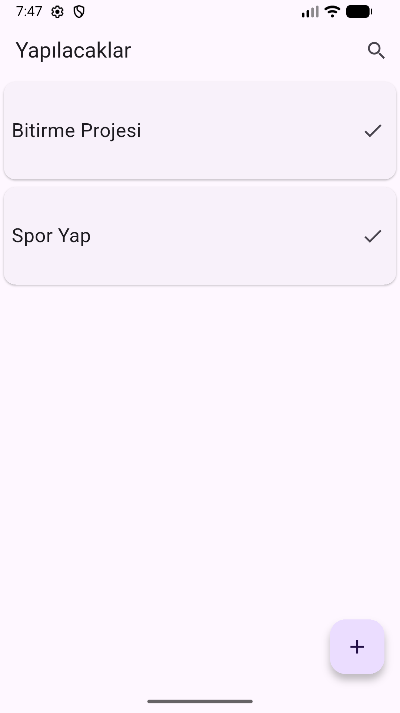
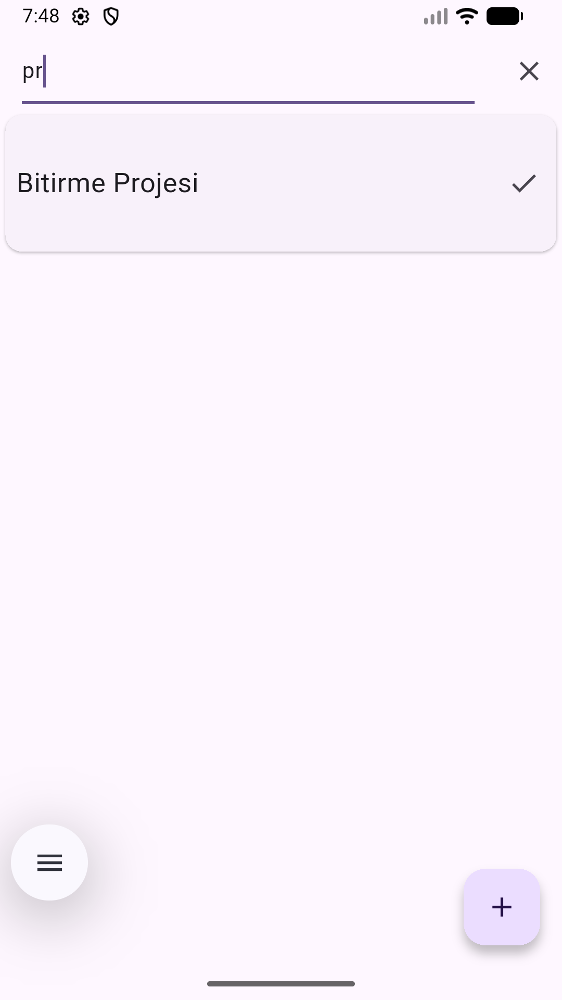

Yapılacaklar Uygulaması (To-Do App)

Flutter ile geliştirilmiş SQLite tabanlı görev yönetim uygulaması.

Özellikler

- Görev ekleme, güncelleme, listeleme
- SQLite ile kalıcı veri saklama
- Arama ve filtreleme
- Temiz ve modern kullanıcı arayüzü
- CRUD operations (Create, Read, Update, Delete)
  

Kullanılan Teknolojiler

- Flutter - Cross-platform framework
- Dart - Programlama dili
- SQLite - Local database
- BLOC Pattern - State management

Öğrendiklerim

- SQLite database yönetimi
- CRUD operations
- Flutter navigation
- Search ve filtreleme
- Kullanıcı arayüzü tasarımı
- 

Ekran Görüntüleri

Anasayfa

Arama

Detay

Yeni Ekle

Proje Tarihi: Ocak 2025  
Durum: Tamamlandı
